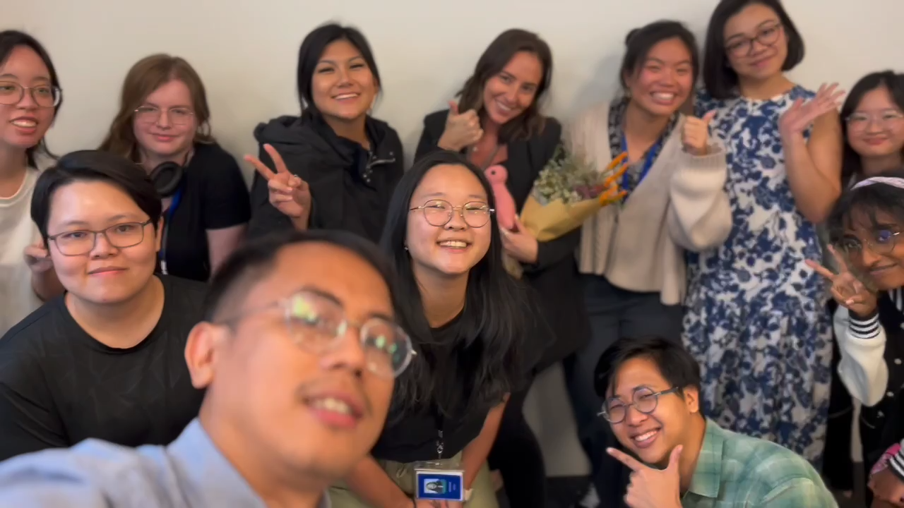
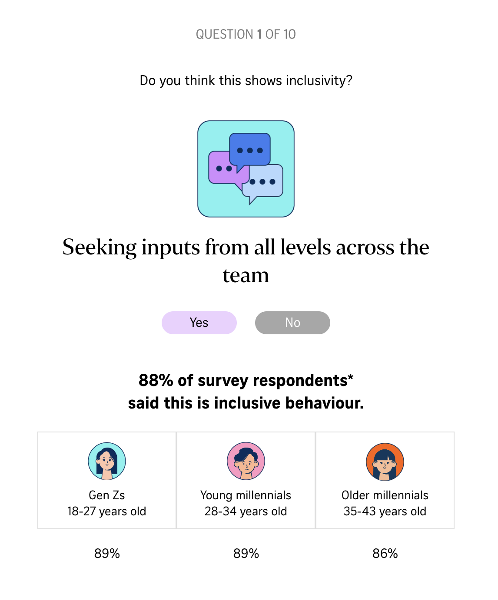
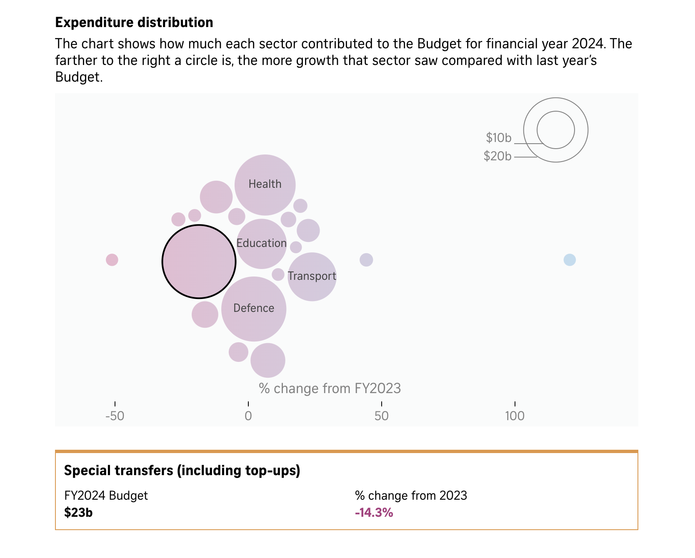
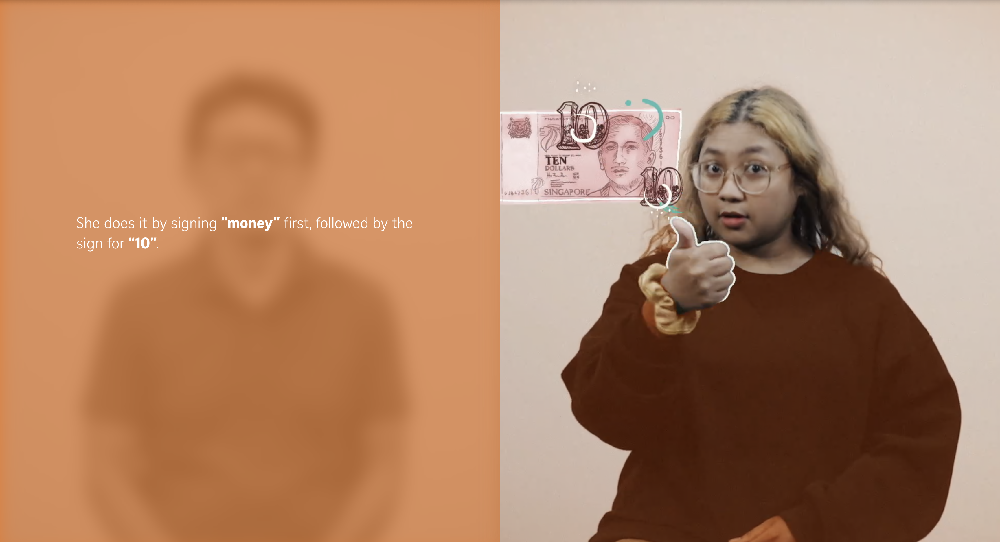

# ST Graphics Reflection



[SPH_Khoo Zi Qi.pdf](SPH_Khoo_Zi_Qi.pdf)

Final Internship Report

[https://sutdapac-my.sharepoint.com/:w:/r/personal/ziqi_khoo_mymail_sutd_edu_sg/_layouts/15/doc2.aspx?sourcedoc=%7BBF2A4892-2F1C-4CFF-B333-F730486ECB22%7D&file=Report%20Cover%20-%20Interim%20Internship%20Report.docx&action=default&mobileredirect=true](https://sutdapac-my.sharepoint.com/:w:/r/personal/ziqi_khoo_mymail_sutd_edu_sg/_layouts/15/doc2.aspx?sourcedoc=%7BBF2A4892-2F1C-4CFF-B333-F730486ECB22%7D&file=Report%20Cover%20-%20Interim%20Internship%20Report.docx&action=default&mobileredirect=true)

# Kantar inclusivity quiz (26/8/24 to 2/9/24)

https://www.straitstimes.com/multimedia/graphics/2024/09/are-you-an-inclusive-colleague/index.html



For my first project, the Kantar Inclusivity Quiz (26/8/24 to 2/9/24), I took on the responsibility of creating the quiz component using my newly acquired skills in Svelte. This project involved an iterative process, where I focused on establishing a solid, functional base for the quiz before refining it further.

One of the main challenges I faced was organizing my code, particularly with CSS classes, to ensure the structure remained clean and readable. I realized the importance of balancing functionality with maintainability, rather than simply getting the task done. Following the Figma design template closely, I worked to ensure the final product was as detailed and precise as possible.

I also expanded my knowledge of responsive design during this project. I learned about using "rem" units, which default to 16px, to make the quiz more adaptable across different screen sizes. Additionally, I gained a deeper understanding of line height adjustments, which further enhanced the responsiveness and readability of the quiz.

Under the guidance of my colleagues, a designer, and a developer, I learned about the workflow in this environment. I was introduced to ArchiML, a tool used for long-form content that allows non-technical individuals, like writers, to input content easily. This experience helped me grow not only as a developer but also in understanding the collaboration between technical and non-technical teams.

# Moonshot Ideas (5/9/24 to 11/9/24)

https://docs.google.com/presentation/d/1vBnLPjAZnYfkUzKmC6ytQEZRkr7ofryPVka3tSws0Ms/edit#slide=id.p

It is tradition for the ST Digital Graphics team to have a yearly presentation where each participant had 5 minutes to present at least 1 Moonshot idea. I shared two concepts focused on Singaporean culture and social issues.

1. **Exploring the Evolution of Street Hawkers: The Rise of Hawker Culture in Singapore**
    
    I introduced a game idea called *Hawker Experience*, designed to immerse players in the life of a street hawker in the 1950s. The game would allow players to:
    
    - Step into the shoes of a hawker in old Singapore, learning the trade and managing a stall.
    - Experience the growth of their business while witnessing the city’s development over time.
    - Emphasize Singapore's rich hawker history and culture.
    
    I highlighted that this game concept is quite unique, particularly focusing on Singapore’s hawker heritage, something not commonly explored in the gaming world. However, I also raised a concern about the potential time and resources required to develop a project of this scale.
    
2. **Community Cats Movement**
    
    The second idea focused on the importance of community cat caregivers in Singapore, spotlighting their challenges and the significance of their efforts.
    
    - I outlined the dangers faced by community cats, such as attacks from other animals, abuse, road accidents, and urban hazards like food scarcity and shelter issues.
    - I proposed that we could use data visualization to emphasize the seriousness of these dangers and shared references to community cat stories and the role of caregivers.
    - The caregivers’ struggle with financial and emotional burdens, limited resources, and burnout was also discussed, drawing attention to their often unrecognized work.
    
    I then presented a game concept called *Caregiver Simulation*. In this game:
    
    - Players take on the role of a community cat caregiver, managing limited resources to care for cats while dealing with stress and ensuring the animals' safety.
    - The game offers a realistic portrayal of the everyday challenges faced by these caregivers, aiming to create empathy for their situation.

Both ideas aimed to engage players while raising awareness of important cultural and social issues.

# **Update Related component #159 (10/9/24 to 11/9/24)**

[**Update Related component #159**](https://www.notion.so/Update-Related-component-159-c02e69c0a22d41559db4304890ddd3bf?pvs=21)

The third week of my internship, I was tasked with fixing an issue related to a component that was showing articles with invalid images. I took the initiative to message a developer to receive this task and started working on it independently.

Before seeking further assistance, I tried my own iterations of fixing the issue. However, to improve the solution and gain more insight, I reached out to a developer in the office for a pair programming session. This collaboration was very productive, and I learned valuable techniques.

One significant takeaway from this task was the practical application of Promises in JavaScript. While I had studied Promises during my Elements of Software Construction course, it was fascinating to see how useful they are in real-world projects. The experience deepened my understanding of asynchronous operations.

Ultimately, I was able to successfully resolve the issue and push my code to the team's mono-repository, which contributed to the project's progress. This task gave me a better understanding of how theoretical concepts apply in real-life software development.

```jsx
// Function to check if the image exists
  function checkImageExists(url: string) {
    return new Promise((resolve) => {
      const img = new Image()
      img.onload = () => resolve(true) // Image loaded successfully
      img.onerror = () => resolve(false) // Image failed to load
      img.src = url
    })
  }

  // Function to process articles and check if image exists
  const processArticles = async (articleList: any[]) => {
    for (let article of articleList) {
      if (await checkImageExists(article.image)) {
        if (list.length < 4 && article.link?.split('?')[0] != window.location.href.split('?')[0]) {
          list = [...list, article] // Add valid article to the list
        }
      } else {
        console.log('Related Article: Image does not exist:', article.title)
      }
      // Stop processing once we have 4 valid articles
      if (list.length >= 4) break
    }
  }

  onMount(async () => {
    // Fetch articles or use the provided list if it has at least 4 articles.
    let initialList = shuffleArray(
      articles && articles.length >= 4 ? articles : await fetchData()
    ).slice(0, 20)

    // Process initial list
    await processArticles(initialList)
  })
```

# SEO (12/9/24 to 19/9/24) (1/10/24 to 3/10/24)

[SEO (12/9/24 to 19/9/24) (1/10/24 to 3/10/24)](https://www.notion.so/SEO-12-9-24-to-19-9-24-1-10-24-to-3-10-24-326db68a94684189a7e2a60185922edc?pvs=21)

Next, I was tasked to work on **Search Engine Optimization (SEO)**, specifically focused on increasing website visibility across search engines like Google. This role has allowed me to apply technical SEO concepts to real-world projects while also deepening my understanding of the importance of optimizing web content for searchability.

One key project I worked on was implementing meta tags to improve the discoverability of visual data-driven content. Following Google's recommendation to display large images on Google Discover, I updated the meta tags in the relevant Svelte files to ensure that our content stands out. For example, I added the `<meta name="robots" content="max-image-preview:large">` tag, which tells Google to display our images bigger. This is a crucial strategy, as successful case studies—like a food blog's 79% boost in click-through rates—show how important images can be for engagement.

Additionally, I explored **structured data** as part of our SEO strategy. I worked with JSON-LD to implement rich results for news articles and paywalled content. Using the structured data markup, I was able to provide Google with the necessary information to generate rich snippets in search results, improving both visibility and user experience. I encountered challenges when testing certain URLs that were not eligible for rich results, but this gave me valuable insights into structured data guidelines and the importance of proper setup for eligibility.

Moving forward, I look forward to continuing my work on SEO strategies that leverage both data and technical expertise to drive traffic and user engagement.

# Budget Numbers 2025 (1/10/24 to 20/10/24)

[Budget Numbers 2025 (1/10/24 to)](https://www.notion.so/Budget-Numbers-2025-1-10-24-to-111fe2f67a168068ae40c2aaedcb900d?pvs=21)



In this project, I worked on improving the ‘Budget Numbers 2025’ visualisations by automating and refining the workflow for better accuracy and responsiveness. The goal was to enhance how fiscal data was presented, such as revenue, expenditure, and historical summaries, making the process more user-friendly and efficient.

Key changes included automating the display of the "current year" in various charts, such as the budget summary and revenue breakdown, allowing for dynamic updates based on the latest data. I also tackled specific challenges like changing colour codes based on whether we had a surplus or deficit, which was initially a manual process but was successfully automated.

Another focus was on improving the clarity and legibility of the data, particularly on different screen sizes. For example, I shortened the names of tax categories for better mobile display and ensured that labels in bubble charts dynamically reflected the largest sectors. I also dealt with house-style issues, such as standardising decimal places to ensure consistency in how large numbers were displayed.

Overall, this project emphasised the importance of workflow improvements, automation, and the dynamic representation of financial data.

# S'pore Best Law Firms 2025 (13/9/24 to 31/10/24)

[S'pore Best Law Firms 2025 (13/9/24 - 31/10/24)](https://www.notion.so/S-pore-Best-Law-Firms-2025-13-9-24-31-10-24-100fe2f67a1680178d26ee4543548870?pvs=21)

https://www.straitstimes.com/multimedia/graphics/2024/10/singapore-best-law-firms-2025/index.html


Working solo on the *Singapore's Best Law Firms 2025* project was a challenging but rewarding experience. Although this annual publication has an established workflow, being responsible for the project’s main tasks provided valuable learning opportunities.

One of the key tools I worked with was Datawrapper, which is essential in their workflow for visualizing data in a clear and reader-friendly format. My main task involved adding a mutually exclusive dropdown bar to the visualizations. The initial setup changed with the project requirements, as we introduced a new category that needed adjustments in the dropdown. I also developed a Python script to clean the CSV files and format the data to meet the standards for Datawrapper integration.

Working with Satoko Nishimura, Manager of Content & Brand, and collaborating with Statista was crucial to ensure that the data was accurate, concise, and ready for publication. This collaborative effort sharpened my attention to detail and honed my data visualization skills to better meet professional standards.

This project is widely recognized, with many top law firms such as Drew & Napier quoting it in their press releases. It was satisfying to contribute to something that the industry values, and I’m grateful for the practical skills I gained in data preparation, automation, and visualization.

# Social media experiment: Body positivity (3/9/24 to )

[Social media experiment: Body positivity (3/9/24 -)](https://www.notion.so/Social-media-experiment-Body-positivity-3-9-24-2328dc3f06cb44019bccd317a748f8f9?pvs=21)

During this project, I analyzed TikTok videos from the #whatieatinaday hashtag to explore trends related to body positivity. My contributions included data collection, where I used yt-dlp to download videos, focusing on those with the highest likes and views. I organized and categorized the videos, managing their metadata in an Excel sheet for further analysis. Additionally, I set up Python scraping tools such as asyncio and playwright and participated in storyboarding sessions to structure the article.

One of the significant challenges I faced was handling captchas. Despite automation efforts, manual captcha resolution remained time-consuming. Another challenge was refining the hashtags, as filtering meaningful content was crucial due to the broad range of topics under tags like #health.

Through this project, I honed my skills in data organization, automation tools, and teamwork. It also deepened my understanding of how social media influences societal perceptions, particularly in the context of body positivity.

# Singlish in Sign Language (5/11/24- 13/12/24)

[Singlish in Sign Language (5/11/24- ) SGSL](https://www.notion.so/Singlish-in-Sign-Language-5-11-24-SGSL-135fe2f67a16801f9670d379ca54406d?pvs=21)




Working on *Singlish in Sign Language* was a rewarding experience that blended technical problem-solving with creative storytelling. I was the main developer working on this story and my main tasks included implementing a dynamic scrolling header with increasing opacity and building custom components like a question block that minimized during scrolling.

I also worked on a split layout inspired by the *Max Maeder Kitefoiling* article, where two overlapping videos transitioned smoothly. Troubleshooting issues like video playback offsets and refining layouts sharpened my technical skills, particularly with Svelte and scrolly telling design.

This project enhanced my expertise in interactive design and demonstrated how thoughtful visuals can make complex topics engaging. It was a valuable experience in combining creativity and technology to create impactful content.